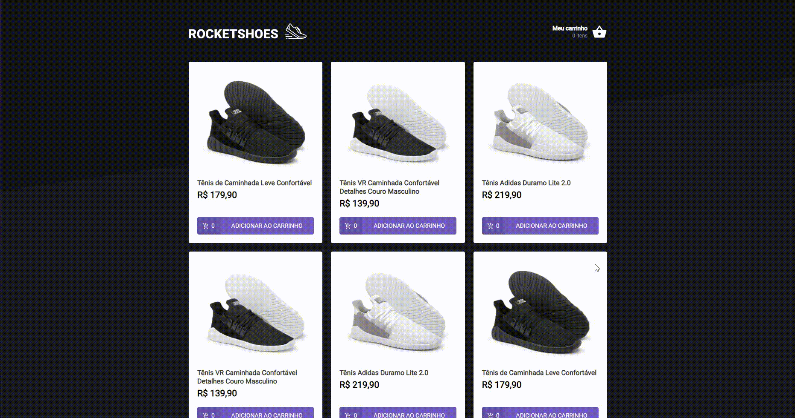
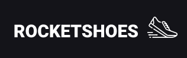

<p align="center">
  <a href="#-tecnologias">Tecnologias</a>&nbsp;&nbsp;&nbsp;|&nbsp;&nbsp;&nbsp;
  <a href="#-preview">Preview</a>&nbsp;&nbsp;&nbsp;|&nbsp;&nbsp;&nbsp;
  <a href="#-getting-started">Getting started</a>&nbsp;&nbsp;&nbsp;|&nbsp;&nbsp;&nbsp;
  <a href="#-projeto">Projeto</a>&nbsp;&nbsp;&nbsp;|&nbsp;&nbsp;&nbsp;
  <a href="#-template">Template</a>
</p>

## 🧪 Tecnologias

Este projeto utiliza as seguintes tecnologias:

- [React](https://reactjs.org)
- [TypeScript](https://www.typescriptlang.org/)
- [Styled Components](https://styled-components.com/)

## 🔥 Preview

[](https://rocketshoes-vf.netlify.app/)\*
<br>

<p align="center">
  <a href="" target="_blank">
    
  </a>
</p>

\*Pode ser que demore um pouco para carregar as informações. Portanto, aguarde um pouco e se persistir tente carregar novamente a página.

## 🚀 Getting started

Clone o projeto e acesse a pasta

```bash
$ git clone https://github.com/Vitor-Franco/02-01-hook-carrinho-de-compras.git && cd 02-01-hook-carrinho-de-compras
```

Siga o passo-passo abaixo.

```bash
# Instale as dependências
$ yarn

# Rode a fake API
$ yarn server

# Start o projeto
$ yarn start
```

## 📝 Projeto

#### Desafio da trilha de ReactJS.

Este desafio visava principalmente a prática do uso de **hooks** no React.
Partindo disto, as funcionalidades **principais** eram:  

**`Carrinho de compras: adicionar um produto, remover e alterar a sua quantidade.`**

**`Listagem de Produtos: listá-los por toda aplicação, mantendo o estado atual em toda aplicação.`**

**`Sinalizar qualquer falha: a partir de um Toast, sinalizar os problemas que possam ocorrer.`**

**`Adicionar as informações do carrinho no LocalStorage`**

Projeto desenvolvido durante Bootcamp Ignite da [@Rocketseat](https://github.com/Rocketseat).

## 🖥 Template

Você pode acessar o template do desafio em:

- [Template Challenge](https://github.com/rocketseat-education/ignite-template-reactjs-criando-um-hook-de-carrinho-de-compras)

---

<p align="center">Made with 💜 by Vitor Franco</p>
